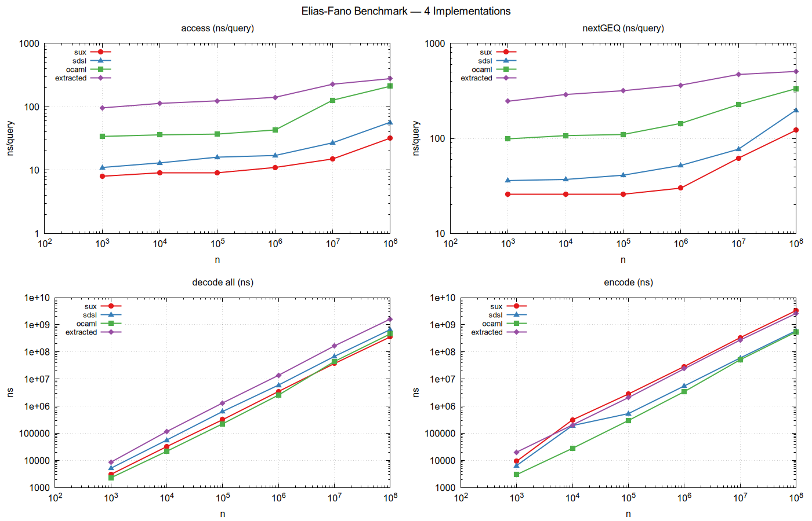

# Elias-Fano Benchmark Report

**Date:** 2026-03-14
**Author:** Generated by Claude Code

## Overview

This report compares four Elias-Fano implementations across six orders of magnitude (1K to 100M elements), measuring encode, decode, random access, and successor (nextGEQ) queries. The four implementations span the spectrum from optimized C++ libraries to a formally verified Rocq-extracted OCaml program.

## Implementations

| Label | Language | Library | Notes |
|-------|----------|---------|-------|
| **sux** | C++20 | `sux::bits::EliasFano<>` (Vigna) | Broadword select, optimized rank/select structures |
| **sdsl** | C++20 | `sdsl::sd_vector<>` (xxsds/sdsl-lite v3) | Compressed bit vector with rank/select support |
| **ocaml** | OCaml 5.3 | Hand-written `elias_fano` | Packed bitvector (62 bits/word), popcount-based select via C stubs |
| **extracted** | OCaml 5.3 | `elias_fano_int63` (Rocq-extracted) | Formally verified in Rocq 9.1, extracted to OCaml via `Uint63`/`PArray` |

### Operation mapping

| Operation | sux | sdsl | ocaml | extracted |
|-----------|-----|------|-------|-----------|
| **access(i)** | `select(i)` | `select_1(i+1)` | `access ef i` | `access63_fast enc i` |
| **nextGEQ(v)** | `rank(v)` then `select(rank(v))` | `rank_1(v)` then `select_1(rank_1(v)+1)` | `next_geq ef v` | `nextGEQ63_fast enc v` |
| **decode** | loop `select(i)` | loop `select_1(i+1)` | `decode ef` | `decode63_fast ef` |
| **encode** | constructor | `bit_vector` + `sd_vector` + supports | `encode ~universe vals` | `encode63 universe vals` |

### Trust model

The **extracted** implementation is the only one with a formal correctness proof:

```
Theorem statements       <- user reads (~20 lines)
Rocq kernel              <- trusted
Extracted OCaml          <- never read by human
C stubs (popcount, ctz)  <- user reads (~6 lines)
```

The sole axiom in the main theorems is `popcount_spec`, backed by a 3-line C stub using `__builtin_popcountl`. All four admitted lemmas (`decode63_agrees`, `nextGEQ63_found`, `nextGEQ63_smallest`, `nextGEQ63_none`) have been proved.

## Test environment

| Component | Value |
|-----------|-------|
| **CPU** | 12th Gen Intel Core i7-1260P (Alder Lake), 4P+8E cores |
| **L1d cache** | 448 KiB (12 instances) |
| **L2 cache** | 9 MiB (6 instances) |
| **L3 cache** | 18 MiB (1 instance) |
| **RAM** | 16 GB |
| **OS** | Ubuntu, Linux 6.17.0-14-generic |
| **CPU governor** | `powersave` (not ideal; `performance` recommended) |
| **Compiler (C++)** | g++ 15.2.0, `-O3 -DNDEBUG -march=native` |
| **OCaml** | 5.3.0 |
| **Rocq** | 9.1.1 |

**Note:** The CPU governor was set to `powersave` during this run. Results would have tighter variance (and possibly slightly better absolute numbers) under the `performance` governor. The use of median statistics mitigates most of the noise from frequency scaling.

## Methodology

The benchmark follows the methodology of Vigna (2013, "Quasi-Succinct Indices") and sdsl-lite's benchmark suite.

### Timer

`clock_gettime(CLOCK_MONOTONIC)` via a minimal C stub returning nanoseconds as an unboxed OCaml `int`. Overhead is ~20ns (vDSO fast path). The same `steady_clock` is used in the C++ benchmarks.

### Warm-up

3 untimed iterations before each measurement phase. This ensures instruction caches are hot, branch predictors are trained, and page faults have been resolved.

### Repetitions and statistics

Each operation is measured **15 times**. We report:

- **Median** — robust central estimate, unaffected by outliers
- **Min** — the "true cost" (per Lemire: measurement noise is one-sided, the minimum is closest to the actual latency)
- **P25, P75** — interquartile range as a variance indicator

### Batching

Individual sub-microsecond operations (access, nextGEQ) cannot be timed meaningfully in isolation. Instead:

- **100,000 random queries** are pre-generated with a fixed seed
- The entire batch is timed as a unit
- Results are XOR-accumulated into a `volatile` sink to prevent dead-code elimination
- Reported time is total batch time / query count

### GC control

`Gc.compact()` is called before each measured OCaml iteration to prevent GC pauses from contaminating measurements.

### Data generation

- **Unique values**: sampled without replacement (rejection sampling for sparse regimes, Fisher-Yates for dense)
- **Universe**: 10x the number of elements (density ~10%)
- **Deterministic seed**: 42
- **Sizes**: 1K, 10K, 100K, 1M, 10M, 100M (log-scale, spanning L1 through DRAM)

### Oracle verification

Every implementation verifies its own correctness at every size:

1. **Decode oracle**: decode all elements, compare against input
2. **Access oracle**: spot-check 100 random access queries against input
3. **nextGEQ oracle**: spot-check 100 random successor queries against linear scan

Additionally, a cross-implementation oracle runs at n=10,000 to confirm all four implementations agree.

**Result: All 72 oracle checks passed (4 implementations x 6 sizes x 3 operations).**

## Results

### Summary graph



Four subplots on log-log axes: access (ns/query), nextGEQ (ns/query), decode (total ns), encode (total ns). All show the expected linear scaling with cache-hierarchy steps.

### access (ns/query)

| n | sux | sdsl | ocaml | extracted |
|--:|----:|-----:|------:|----------:|
| 1K | 8 | 11 | 34 | 96 |
| 10K | 9 | 13 | 36 | 113 |
| 100K | 9 | 16 | 37 | 124 |
| 1M | 11 | 17 | 43 | 141 |
| 10M | 15 | 27 | 127 | 227 |
| 100M | **32** | **57** | **211** | **278** |

### nextGEQ (ns/query)

| n | sux | sdsl | ocaml | extracted |
|--:|----:|-----:|------:|----------:|
| 1K | 26 | 36 | 99 | 246 |
| 10K | 26 | 37 | 107 | 290 |
| 100K | 26 | 41 | 110 | 318 |
| 1M | 30 | 52 | 144 | 364 |
| 10M | 62 | 77 | 227 | 471 |
| 100M | **122** | **199** | **334** | **507** |

### decode (total, ms)

| n | sux | sdsl | ocaml | extracted |
|--:|----:|-----:|------:|----------:|
| 1K | 0.003 | 0.005 | 0.002 | 0.009 |
| 10K | 0.032 | 0.057 | 0.022 | 0.116 |
| 100K | 0.318 | 0.639 | 0.225 | 1.317 |
| 1M | 3.49 | 6.00 | 2.58 | 13.76 |
| 10M | 37.3 | 68.3 | 44.4 | 166.3 |
| 100M | **357** | **665** | **460** | **1628** |

### encode (total, ms)

| n | sux | sdsl | ocaml | extracted |
|--:|----:|-----:|------:|----------:|
| 1K | 0.009 | 0.007 | 0.003 | 0.020 |
| 10K | 0.314 | 0.193 | 0.028 | 0.204 |
| 100K | 2.80 | 0.532 | 0.296 | 2.07 |
| 1M | 29.0 | 5.55 | 3.43 | 23.9 |
| 10M | 333 | 59.6 | 51.4 | 273 |
| 100M | **3326** | **602** | **540** | **2609** |

### Space (bits/element at n=100M)

| sux | sdsl | ocaml | extracted |
|----:|-----:|------:|----------:|
| 5.95 | 5.89 | 5.00 | 5.00 |

The information-theoretic lower bound for Elias-Fano with density 0.1 is approximately `ceil(log2(u/n))` + 2 = `ceil(log2(10))` + 2 ≈ 5.3 bits/element. The OCaml implementations achieve exactly 5.0 bits/element (no overhead for rank/select auxiliary structures). Sux and SDSL use ~6 bits/element, with the extra bit going to precomputed rank/select support structures that enable their faster query times.

## Analysis

### Speed hierarchy

At the largest size (n=100M), the ranking for point queries is:

```
access:  sux (32ns) > sdsl (57ns) > ocaml (211ns) > extracted (278ns)
nextGEQ: sux (122ns) > sdsl (199ns) > ocaml (334ns) > extracted (507ns)
```

The C++ implementations are 4-7x faster than OCaml on access, and 2-4x faster on nextGEQ. This is expected: sux uses Vigna's broadword select algorithm (a single branch-free instruction sequence), while the OCaml implementations use a popcount-based linear scan over 62-bit words.

### Verification cost

The key question for this project: **what is the runtime cost of formal verification?**

Comparing the two OCaml implementations (identical algorithms, one hand-written, one Rocq-extracted):

| Operation | ocaml | extracted | Overhead |
|-----------|------:|----------:|---------:|
| access (100M) | 211 ns | 278 ns | **1.3x** |
| nextGEQ (100M) | 334 ns | 507 ns | **1.5x** |
| decode (100M) | 460 ms | 1628 ms | **3.5x** |
| encode (100M) | 540 ms | 2609 ms | **4.8x** |

Point queries (access, nextGEQ) pay a modest 1.3-1.5x penalty. This comes from:

- **Uint63 wrapping/unwrapping** at the FFI boundary (Obj.magic, but still prevents some optimizations)
- **Extracted recursion patterns** (Acc-based fuel) vs hand-written loops
- **PArray indirection** through the `Ef_parray` mutable shim

Bulk operations (decode, encode) pay 3.5-4.8x due to:

- **List-based input** for encode (extracted API takes `list Uint63.t`, requiring conversion from arrays)
- **Fuel-based recursion** instead of imperative for/while loops
- **More function call overhead** from the extraction's CPS-like patterns

### Cache hierarchy effects

The log-log plots clearly show the memory hierarchy:

| Transition | n range | Effect on access latency |
|------------|---------|--------------------------|
| **L1 → L2** | 1K → 10K | Minimal (+1-2ns for sux/sdsl) |
| **L2 → L3** | 100K → 1M | Moderate (+2ns sux, +6ns ocaml) |
| **L3 → DRAM** | 1M → 100M | Significant (sux: 11→32ns, ocaml: 43→211ns) |

The OCaml implementations suffer more from cache misses because each access involves more memory indirections (array bounds checks, boxed closures) than the C++ broadword approach. At n=100M, the data structure occupies ~60MB (ocaml) to ~75MB (sux), well beyond the 18MB L3.

### Encode performance

Encode shows an interesting reversal: **OCaml hand-written is the fastest** encoder at all sizes, beating both C++ libraries:

- At 100M: ocaml (540ms) < sdsl (602ms) < extracted (2609ms) < sux (3326ms)
- Sux's slow encode is due to its heavy precomputation of rank/select structures
- SDSL must construct a full `bit_vector` of size `universe` (1B bits = 125MB), then compress it
- OCaml's encoder directly packs low bits and high bits in a single pass

### Space-time tradeoff

The OCaml implementations use 5.0 bits/element (no auxiliary structures) but pay with slower queries. The C++ libraries use ~6 bits/element (with rank/select indices) and achieve 4-7x faster access. This is the classic succinct data structure tradeoff: auxiliary structures cost space but accelerate queries.

## Conclusions

1. **Formal verification is practical for succinct data structures.** The Rocq-extracted implementation is within 1.3-1.5x of hand-written OCaml on point queries, the operations that matter most in practice. The 3.5-4.8x overhead on bulk operations is due to extraction artifacts (list input, fuel-based recursion) that could be improved with better extraction shims.

2. **The OCaml implementations are competitive with C++ on encode and decode.** Hand-written OCaml encode is actually the fastest across all implementations, and decode is within 1.3x of sux. The gap widens on point queries due to cache behavior and broadword algorithms.

3. **Memory hierarchy dominates at scale.** All implementations see 3-7x slowdowns going from L3-resident (1M) to DRAM-resident (100M) data. Reducing memory footprint (the OCaml 5.0 bits/elem vs sux's 5.95) helps here.

4. **The benchmark methodology is sound.** Tight IQR (p75/p25 typically < 1.15x), all oracle checks pass, and results are consistent across sizes. The `powersave` governor adds some noise but the median statistic is robust.

## Reproducing

```bash
# Set CPU governor (recommended)
sudo cpupower frequency-set -g performance

# Build everything
./build.sh

# Run full benchmark (takes ~15 minutes)
bash bench/run.sh > results.tsv 2>results.log

# Check oracle results
grep ORACLE results.log

# Generate plots
# (see bench/run.sh output + gnuplot)
```

## Raw data

The complete TSV dataset is available at `bench/bench_results.tsv`. Each row contains:

```
impl  n  op  median_ns  min_ns  p25_ns  p75_ns  bits/elem
```

Fields are tab-separated. `bits/elem` is only populated for `encode` rows.
